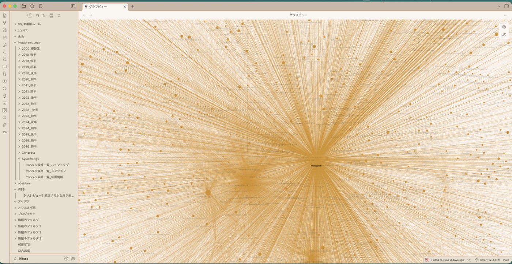
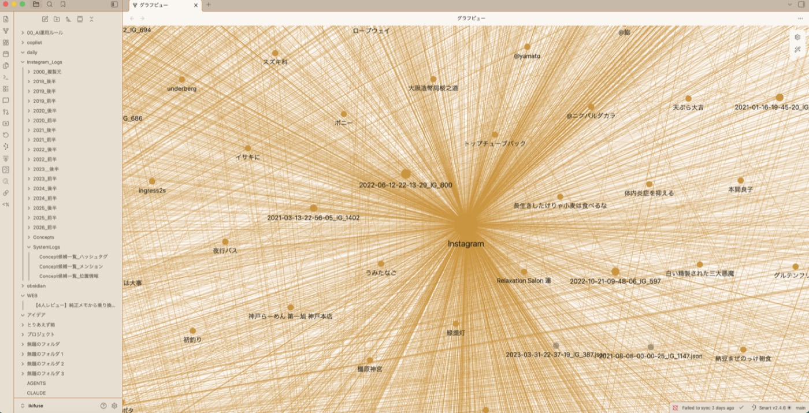
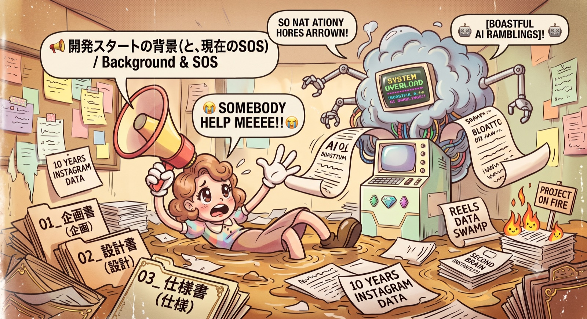
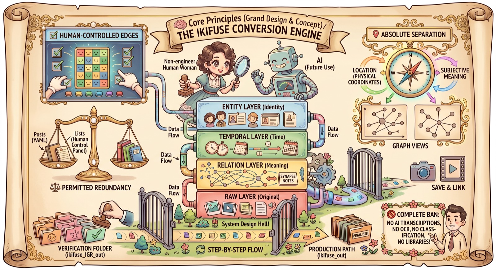
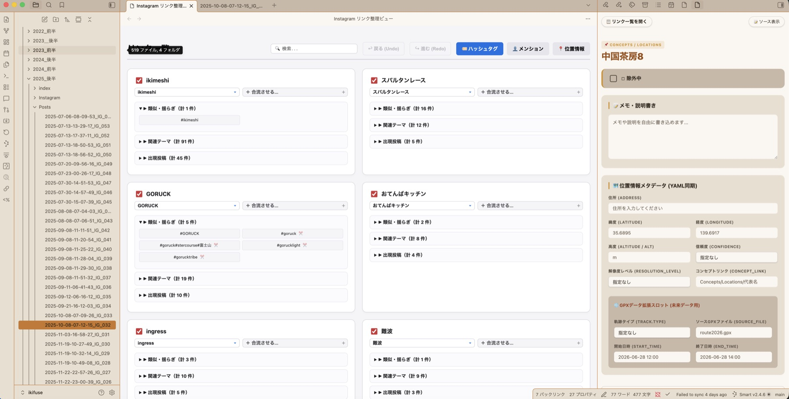

# Metaエクスポートを個人文脈基盤へ再構造化

Instagramのエクスポート記録を、検索・接続・再利用できるObsidian知識ベースへ変換するための実験と実装をまとめています。

## 🗺️ プロジェクト全体マップ

項目を押すと、リポジトリの構成から各文書の内容へ順番に展開できます。

<strong>README.md</strong> — このプロジェクトの入口

開発背景と目的

- 毎回AIへ自分の背景を説明する負担を減らす
- 10年分のInstagramデータを「第二の脳」へ変換する
- Obsidian上に検索・接続・再利用できる知識基盤を構築する
- AIとの共同作業で巨大化した企画・設計・仕様を整理し直す
- 現在は機能追加より、既存工程の整合確認と完走を優先する

設計思想（絶対的なルール）

- 観測事実と将来の意味判断を分ける
- 位置情報（物理座標）とシナプス（意味的接続）を分ける
- 4層の不変スキーマを維持する
  - ENTITY：識別
  - TEMPORAL：時間
  - RELATION：関係・意味
  - RAW：原本
- 各データ種別の隔離出力を経由する
- Phase 1ではAI解析・OCR・文字起こし・クラス化を行わない

リポジトリ構成

- 01：プロジェクト全体の企画
- 02：分冊された全体設計
- 03：継続中の判断材料・引継ぎ（Git管理外）
- 04：データ種別ごとの仕様
- 05：IGP通常投稿の移行実行
- 06：IGRリールの移行実行
- 07：IGSストーリーの移行実行
- 08：IGX欠損サルベージ（現在は保留）
- 09：IGC統合
- 10：Memory Synapse DB
- AGENTS.md・docs：プロジェクト共通の作業ルール
- 99：完了済み参考資料（Git管理外）

現在の作業と完走へのステップ

1. IGP通常投稿を再検証する
2. IGRリールを再検証する
3. IGSストーリーを再検証する
4. IGCを実行し、`output_IGC`を検証する
5. Memory Synapse DBをObsidian上で動作確認する

移行対象と現在のステータス

- IGP：既存出力あり。完成に最も近く、再検証予定
- IGR：既存出力あり。IGP完走後に再検証予定
- IGS：既存出力あり。IGP・IGRに続いて再検証予定
- IGC：3系統の完走後に統合・検証
- Memory Synapse DB：IGC完了後に動作確認
- IGX：現在は保留

開発参加者向け案内

- 検証には参加者自身のInstagramエクスポートデータが必要
- オーナーは非エンジニアのシステム設計者
- 目的や理由は企画書、構造は設計書、実行条件は仕様書で確認する
- 進行状況と再開点は引継ぎ資料とGitHub Issuesで管理する
- 変更提案は、目的と変更対象を示したIssueとして起票する
- コミュニケーションは日本語を前提とする

<strong>01_IG移行企画書v1.0.md</strong> — 目的・理由・到達点

- [企画書を開く](01_IG移行企画書v1.0.md)
- 第1章：プロジェクト概要
- 第2章：プロジェクトの背景
- 第3章：本プロジェクトが目指すもの
- 第4章：設計判断の基本方針
- 第5章：文書体系と優先順位
- 第6章：将来構想

<strong>02_IG移行設計書</strong> — 全体設計の分冊

00_設計書目次.md

- [設計書目次を開く](02_IG移行設計書/00_設計書目次.md)
- 設計正本の範囲
- 6冊の読み分け
- 企画・仕様・コードとの関係

01_設計目的・対象範囲・基本原則.md

- [文書を開く](02_IG移行設計書/01_設計目的・対象範囲・基本原則.md)
- 設計の目的
- 対象範囲と対象外
- オーナーとAIの責任
- 設計原則
- 文書体系との関係

02_システム全体構成・責任境界.md

- [文書を開く](02_IG移行設計書/02_システム全体構成・責任境界.md)
- システム全体像
- データソース・変換・出力の責任
- IGCの責任境界
- Memory Synapse DBの責任境界
- 人間判断とAI利用の境界

03_データ構造・原本保持設計.md

- [文書を開く](02_IG移行設計書/03_データ構造・原本保持設計.md)
- データの基本単位
- 原本・監査・派生・意味情報の区別
- 識別・日時・関係情報
- メディアと抽出事実
- 将来情報源を追加できる境界

04_データ取得・変換・出力設計.md

- [文書を開く](02_IG移行設計書/04_データ取得・変換・出力設計.md)
- データ種別ごとの独立性
- 入力と原本保持
- 抽出・変換・出力の責任
- 欠損・未知形式・処理失敗
- 再実行・検証・再現性

05_リンク・意味ネットワーク設計.md

- [文書を開く](02_IG移行設計書/05_リンク・意味ネットワーク設計.md)
- Wikiリンク型データベース
- TimelineとSynapse
- 観測事実と意味情報
- 人間が育てる意味ネットワーク

06_検証・運用・保全・拡張設計.md

- [文書を開く](02_IG移行設計書/06_検証・運用・保全・拡張設計.md)
- 検証と完了条件
- 再実行・修復・復旧
- ローカル運用とデータ保護
- 文書・コード・成果物の保全
- 将来拡張の境界

<strong>04_IG移行仕様書</strong> — データ種別ごとの実行条件

01_IG移行共通仕様書v1.2.md

- [文書を開く](04_IG移行仕様書/01_IG移行共通仕様書v1.2.md)
- 共通パイプライン
- YAML・出力ディレクトリ・Markdown
- Synapse・リンク・Timeline
- エラー・ログ・再実行・設定
- 実データ監査による事実差分

02_IGP移行仕様書v1.2.md

- [文書を開く](04_IG移行仕様書/02_IGP移行仕様書v1.2.md)
- 通常投稿の入力
- 投稿・メディア・RawData
- Timeline・Synapse・SystemLogs
- 検証と例外処理

03_IGR移行仕様書v1.2.md

- [文書を開く](04_IG移行仕様書/03_IGR移行仕様書v1.2.md)
- リールの入力
- 動画・投稿情報・RawData
- Timeline・Synapse・SystemLogs
- 検証と例外処理

04_IGS移行仕様書v1.2.md

- [文書を開く](04_IG移行仕様書/04_IGS移行仕様書v1.2.md)
- ストーリーの入力
- Story本文とハイライト所属の分離
- メディア・RawData・Timeline
- Synapse・SystemLogs・検証

05_IGX移行仕様書v1.2.md

- [文書を開く](04_IG移行仕様書/05_IGX移行仕様書v1.2.md)
- 欠損サルベージの対象
- 分類不能データ
- 出力と検証
- 現在は保留

06_Memory_Synapse_DB_仕様書v1.2.md

- [文書を開く](04_IG移行仕様書/06_Memory_Synapse_DB_仕様書v1.2.md)
- Memory Synapse DBとの接続条件
- 入出力と操作
- データ保護と検証

<strong>AGENTS.md ＋ docs</strong> — プロジェクト共通ルール

AGENTS.md

- [共通AGENTSを開く](AGENTS.md)
- 目的と最上位条件
- 全工程で守る判断原則
- 作業範囲と停止条件
- 読み込みルーター
- データ保護
- 編集・記録・外部操作

docs

- [企画工程](docs/planning-workflow.md)
- [設計工程](docs/design-workflow.md)
- [仕様工程](docs/specification-workflow.md)
- [文書の配置・退役](docs/document-governance.md)
- [恒久ルールの追加・修正基準](docs/rule-addition-criteria.md)

<strong>09_IGC統合</strong> — 3系統の出力を統合

01_IGC統合企画書v1.0.md

- [企画書を開く](09_IGC統合/01_IGC統合企画書v1.0.md)
- 実現したいこと
- 出力したいもの
- 3種類の統合
- 人間とUIの役割
- 安全と現在の位置付け

02_IGC統合設計書v1.0.md

- [設計書を開く](09_IGC統合/02_IGC統合設計書v1.0.md)
- 入力と出力
- 統合単位
- Synapse・SystemLogsの統合構造
- 入力不一致とIDの境界
- Memory Synapse DBとの責任境界
- 安全更新と検証条件

03_IGC統合仕様書

- [仕様書目次](09_IGC統合/03_IGC統合仕様書/00_仕様書目次.md)
- [役割・入力形式](09_IGC統合/03_IGC統合仕様書/01_役割・入力形式.md)
- [統合・出力形式](09_IGC統合/03_IGC統合仕様書/02_統合・出力形式.md)
- [異常処理・検証・安全更新](09_IGC統合/03_IGC統合仕様書/03_異常処理・検証・安全更新.md)
- [実行結果・コード構成・対象外](09_IGC統合/03_IGC統合仕様書/04_実行結果・コード構成・対象外.md)

AGENTS.md ＋ docs

- [IGC専用AGENTSを開く](09_IGC統合/AGENTS.md)
- 専用`docs/`は現在未配置
- 共通工程はルートの`docs/`を適用

<strong>10_Memory_Synapse_DB</strong> — Obsidian上で知識を育てる

README.md

- [専用READMEを開く](10_Memory_Synapse_DB/README.md)
- 現在の構成
- 安全上の境界
- ビルド
- レビュー参加者向け案内

01_Memory_Synapse_DB_企画書v2.1.md

- [企画書を開く](10_Memory_Synapse_DB/01_Memory_Synapse_DB_企画書v2.1.md)
- プロジェクトの位置付け
- 解決したい課題
- 実現したい価値
- データを守る原則
- 現在の対象範囲
- 継続して守る原則
- 将来構想
- 文書体系と判断の優先順位

02_Memory_Synapse_DB_設計書

- [設計書目次](10_Memory_Synapse_DB/02_Memory_Synapse_DB_設計書/00_設計書目次.md)
- [目的・入力・データ保護](10_Memory_Synapse_DB/02_Memory_Synapse_DB_設計書/01_目的・入力・データ保護.md)
- [大きなカード・受け皿・融合](10_Memory_Synapse_DB/02_Memory_Synapse_DB_設計書/02_大きなカード・受け皿・融合.md)
- [表示・手書き・分離](10_Memory_Synapse_DB/02_Memory_Synapse_DB_設計書/03_表示・手書き・分離.md)
- [確認環境・実装環境](10_Memory_Synapse_DB/02_Memory_Synapse_DB_設計書/04_確認環境・実装環境.md)

03_Memory_Synapse_DB_仕様書

- [仕様書目次](10_Memory_Synapse_DB/03_Memory_Synapse_DB_仕様書/00_仕様書目次.md)
- [役割・対象データ](10_Memory_Synapse_DB/03_Memory_Synapse_DB_仕様書/01_役割・対象データ.md)
- [個別カード・融合状態](10_Memory_Synapse_DB/03_Memory_Synapse_DB_仕様書/02_個別カード・融合状態.md)
- [表示・手書き情報](10_Memory_Synapse_DB/03_Memory_Synapse_DB_仕様書/03_表示・手書き情報.md)
- [融合・分離・取消・復旧](10_Memory_Synapse_DB/03_Memory_Synapse_DB_仕様書/04_融合・分離・取消・復旧.md)
- [ブラウザー確認・Obsidian実装・実物検証](10_Memory_Synapse_DB/03_Memory_Synapse_DB_仕様書/05_ブラウザー確認・Obsidian実装・実物検証.md)

AGENTS.md ＋ docs

- [Memory Synapse DB専用AGENTS](10_Memory_Synapse_DB/AGENTS.md)
- [専用docs目次](10_Memory_Synapse_DB/docs/README.md)
- [設計工程](10_Memory_Synapse_DB/docs/design-workflow.md)
- [仕様工程](10_Memory_Synapse_DB/docs/specification-workflow.md)
- [実装工程](10_Memory_Synapse_DB/docs/implementation-workflow.md)

### 📸 IGPの一部成果物をObsidianへ確認投入したグラフビュー（10年分のデータの繋がり）

| 1. 拡大図（Instagramをハブとした各ノートの繋がり） | 2. 全体図（10年分の関係性の広がり） |
| :---: | :---: |
|  |  |

---

### 🎬 IGP検証中に確認できた、10年分の人生ログがニューロンのように繋がる姿（グラフビュー 2分間アニメーション）
<video src="https://github.com/user-attachments/assets/40c4c8e6-9325-486e-a54e-ee70ffdaf953" loop autoplay muted playsinline width="100%"></video>

---

## 1. 📢 開発スタートの背景（と、現在のSOS）

> 💡　もともとは、AIの勉強を始めてアプリを作っているときに、「毎回AIに自分の背景を説明するのめんどくさいな…」と思ったのが始まりです。 
> 
> 🚀　YouTubeで「Obsidian」というノートアプリを知り、メモを溜めようとしたのですが、自分で書くのはなかなか溜まりません。そこで、
> **「あ！自分の10年分のSNS（Instagram）データを丸ごとぶち込めば、一瞬で『第二の脳』ができるじゃん！」**
> という軽いノリでこのプロジェクトをスタートしました。 
> 
> 🌋　**……が、ここからAIとの泥沼の格闘が始まりました。** 
> 
> 🤖　AIと格闘しているうちに、一つのアイデアが勝手にどんどん膨らみ、気づけば勝手に仕様書まで生み出され、何が「やりたいこと（企画）」で、何が「システム構造（設計）」で、何が「手順（仕様）」なのかさっぱり分からなくなりました。AIがすぐに暴走して話を盛るため、素人の手には負えないレベルの**「大量の巨大な概要メモ」**に膨れ上がり、大炎上したのです。 
> 
> 📁　「このままでは絶対に破綻する！」と危機感を覚え、後から必死に交通整理して分けたのが、このリポジトリにある **「企画書（01_）」「設計書（02_）」「仕様書（03_）」** です。（これらはAIの暴走と格闘した涙の痕跡です…笑） 
> 
> 現在、完成した移行工程はまだありません。通常投稿（Post / IGP）が完成に最も近く、出力の一部をObsidianへ入れて実物確認しながら、設計・仕様・コード・成果物の不一致を直しています。Reel（IGR）とStory（IGS）にも既存出力はありますが、同じ基準での再検証が終わっていません。 

---

📦　このリポジトリは、プログラミング未経験で、AIを学び始めてまだ日が浅いオーナーがAI（LLM）と二人三脚で設計・構築を進めている、**「過去10年分のInstagram全データをObsidian（Markdown）へ構造化・移行する」**ための独立移行エンジン群の保管庫です。一つの案から始まった仕組みが大きくなり、オーナー一人では全体を追いにくい規模になっていますが、実データを使うコードと成果物まで進められていることも事実です。現在は機能追加より、完走できる範囲へ戻して整合を取り直すことを優先しています。 

🧩　Instagram/Facebookは長期利用の中で投稿形式・ストーリー・動画・複数枚投稿・位置情報・エクスポートJSON構造が変化してきたため、本プロジェクトでは現在形式だけに最適化せず、過去形式・欠損・分類不能データも受け止められる構造を重視しています。 

⚙️　フィード、リール、ストーリー、サルベージには既存コードがありますが、現在の承認済み完走点はIGP・IGR・IGSの検証・完走に加え、IGC統合の実行検証（`output_IGC`完成）、およびMemory Synapse DB（Obsidianプラグイン）の動作確認までです。IGPは1,842投稿と7,487メディアの既存出力があり、最も検証が進んでいます。IGRには77件、IGSには1,521件の既存出力があります。IGX（サルベージ）は上記完走後まで保留します。 

🧭　現在は分冊設計を基準に仕様（v1.2）を直し、IGPから順にコードと既存出力を合わせ直す段階です。IGP → IGR → IGS の順で検証し、その後 `output_IGC` への統合とObsidianプラグイン上での表示確認を行います。 

🎬　言葉だけではシステム全体の完成イメージを伝えるのが難しいため、冒頭とページ下部に動作デモ動画を用意しました。これらはイメージ動画ではなく、**現在どちらも実際に実装・動作しており、理想に向けて稼働している本物の録画映像**です。まずはこれらの動画をご覧いただき、「何を実現しようとしているのか」を察していただけると嬉しいです。当初は非公開でしたが、広くエンジニアの皆様の知恵をお借りするため、公開リポジトリとしてオープンにしました。どうぞよろしくお願いいたします！ 

---

## 2. 🧠 本プロジェクトの核心（グランドデザインと設計思想）

🧠　本システムは、単なるデータのバックアップではなく、**「将来的にAIがオーナーの過去の文脈（コンテキスト）を完全に理解するための知識ベース（第二の脳）」**を作るためのデータ変換エンジンです。 

⚙️　そのため、以下の**絶対的なルール・原則（設計思想）**に基づいてコードが書かれています。 

### 2.1. ⚖️ 観測事実と将来の意味判断を分ける
* ⚖️　現在のIGP・IGR・IGSは、投稿、RawData、メディア、ハッシュタグ・メンション・位置情報の抽出事実を失わず出力します。 
* 🔄　人間が育てる意味ネットワーク、採用判断、融合・分離の操作は、未完成のIGCとMemory Synapse DBの将来工程です。現在の抽出コードが空の人間用メモや採用欄を先回りして作りません。 

### 2.2. 📍 位置情報（物理）とシナプス（意味）の絶対分離
* 📍　`location` プロパティは普遍の「物理座標レイヤー（現実座標）」として扱い、主観的な「意味（なぜそこにいたか）」とは明確に切り離してGraph View上で混ざらないようにします。 

### 2.3. 🗂 ユニバーサル不変スキーマ（4層構造）の厳格性
* 🗂　将来の拡張性（FacebookログやGPSログの合流）を見据え、全てのデータは **①ENTITY LAYER（Identity）、②TEMPORAL LAYER（Time）、③RELATION LAYER（Meaning）、④RAW LAYER（Original）** の4層構造に固定して永続化します。 

### 2.4. 🔄 段階的出力フロー（ワンクッション方式）
* 🔄　既存データを破壊しないよう、各データ種別は専用の隔離フォルダ（`output_IGP`、`output_IGR`、`output_IGS`）へ出力します。各抽出工程から`output_IGC`や実Vaultへ直接再実行しません。`output_IGP`の一部をObsidianへ入れたのは、実物を見ながら設計を検証するためであり、本番全件移行ではありません。 

### 2.5. 🚫 AI解析・クラス化の完全禁止（Phase 1 スコープ）
* 🚫　音声の文字起こしやOCR、画像解析、およびコードのクラス化や共通ライブラリ化は**一律禁止**としています。画像・動画は単純な保存とMarkdownへのリンク表示のみに留めます。（※非エンジニアのオーナーがコードの処理を1行ずつ直接理解し、将来も自身で保守し続けるための制約です） 

---

## 3. 📁 リポジトリの構成ファイル

📁　現在、以下のドキュメントとスクリプトが格納されています。 

> ℹ️　先頭の数字は読む順番とシステムの役割（01:企画 → 02:設計 → 03:判断材料 → 04:仕様 → 05〜10:実行・統合）を示します。 

* 📄　**[01_IG移行企画書v1.0.md](01_IG移行企画書v1.0.md)**：プロジェクト全体の目的・設計思想を規定する最上位企画書 
* 🗺️　**[02_IG移行設計書/](02_IG移行設計書/)**：目次1冊＋設計6冊の現役分冊設計書（`00_設計書目次.md` 〜 `06_検証・運用...md`）。※ルートの `02_IG移行設計書.md` は履歴・復元用として保持 
* 🗂️　**[03_継続中の判断材料・引継ぎ/](03_継続中の判断材料・引継ぎ/)**：未確定課題やJSON解析記録、最新引き継ぎ資料（`08_引き継ぎ書_IGS再開_2026-07-14.md`等）を保管 
* 🗃️　**[04_IG移行仕様書/](04_IG移行仕様書/)**：現行のv1.2仕様書群（`01_共通` / `02_IGP` / `03_IGR` / `04_IGS` / `05_IGX` / `06_Memory_Synapse` 各v1.2.md） 
* 📂　**[05_IGP移行_実行/](05_IGP移行_実行/)**：通常投稿（Post）実行スクリプト群（`IGP_00_セッテイv1_1.py` 〜 `IGP_05_シナプス管理v1_1.py`） 
* 📂　**[06_IGR移行_実行/](06_IGR移行_実行/)**：リール（Reel）実行スクリプト群（`IGR_00_` 〜 `IGR_05_`） 
* 📂　**[07_IGS移行_実行/](07_IGS移行_実行/)**：ストーリー（Story）実行スクリプト群（`IGS_00_` 〜 `IGS_05_`） 
* 📂　**[08_IGX移行_実行/](08_IGX移行_実行/)**：欠損サルベージ実行スクリプト群（`IGX_00_` 〜 `IGX_05_`／現在は保留） 
* 🔗　**[09_IGC統合/](09_IGC統合/)**：IGC統合工程（`01_企画`, `02_設計`, `03_仕様`, `04_実行/`） 
* 🧠　**[10_Memory_Synapse_DB/](10_Memory_Synapse_DB/)**：Obsidianプラグイン・Synapse DB（`01_融合計画書`, `02_企画書v2.0`, `09_実行.py`, `main.js`等） 
---

## 4. 🛠 現在の作業と完走へのステップ

🛠　現在の承認済み完走点は、IGX（サルベージ）を一旦対象外としたうえで、**IGP・IGR・IGSを検証・完走し、さらに `09_IGC統合` を実行して `output_IGC` を完成させ、`10_Memory_Synapse_DB`（Obsidianプラグイン）を動作させてObsidian上で成果を確認できる状態まで**と規定しています。 

現在、以下の順番で1ステップずつコード・仕様（v1.2）・実成果物の整合性を取り直しています。 

1. 🟡 **通常投稿（IGP）の再検証**
   * 現行の `05_IGP移行_実行/` コードを `v1.2仕様` に合わせ、1,842投稿・7,487メディアの出力を実成果物で完全検証します。 
2. 🟡 **リール（IGR）の再検証**
   * IGP完了後、`06_IGR移行_実行/` の77件の出力を同じ完成基準で再検証します。 
3. 🟡 **ストーリー（IGS）の再検証**
   * `07_IGS移行_実行/` の1,521件の出力を再検証します。（※ハイライトの所属関係はエクスポートJSONに直接対応表がないため、Story本文の技術移行と分離して扱います） 
4. 🔗 **IGC統合の実行と検証**
   * 3系統の出力を統合し、`09_IGC統合/` を実行して本番用 `output_IGC` を生成・検証します。 
5. 🧠 **Obsidianプラグインの動作確認**
   * `10_Memory_Synapse_DB/` のプラグインを起動し、Obsidian上で成果が正しく表示・接続されることを確認して完走とします。 

🤝　現在の作業状況、未解決事項、引き継ぎは `03_継続中の判断材料・引継ぎ/` や GitHub Issues で管理します。安定した目的・設計・仕様は、リポジトリ内の対応文書を正とします。 

---

## 5. 🟢 現状と進行ステータス

* 🟡　**通常投稿（Post / IGP）移行**：完成に最も近い工程。1,842件の既存出力とObsidianへの一部確認投入あり。v1.2仕様へ合わせて再検証予定 
  
  **【グラフビューでの全体像は冒頭のデモを参照】**
  
  **【Obsidian上でのカード化・DM表示イメージ】**
  
  
  **【Obsidian上でのカード化・DM表示デモ（2倍速タイムラプス）】**
  <video src="https://github.com/user-attachments/assets/d39bb8b7-1374-4fbb-a8e7-41d484d28963" loop autoplay muted playsinline width="100%"></video>

* 🟡　**リール（Reel / IGR）移行**：既存出力77件あり。IGP完走後にv1.2仕様・コード・成果物を再検証 
* 🟡　**ストーリー（Story / IGS）移行**：既存出力1,521件あり。IGP・IGRに続いて再検証 
* 🔗　**IGC統合（IGC）**：IGP・IGR・IGSの完走後に `output_IGC` への統合・再検証を実施 
* 🧠　**Obsidianプラグイン（Memory Synapse DB）**：IGC統合完了後、Obsidian上での表示・接続動作を確認 
* ⚪️　**欠損サルベージ（IGX）移行**：現在は保留。上記完走後に再開可否を判断 

---

## 6. 🤝 開発の進め方・ご相談について

* ⚙️　**動作テスト用のデータについて（ご協力のお願い）** 
  * 📦　テストを行う際は、お手数ですがご自身のInstagramデータ（Meta社からJSON形式でエクスポートしたもの）をご用意の上、配置して検証をお願いいたします。オーナー側でテスト用のモックデータをご用意することが難しいため、ご協力をお願いいたします。 
* 👤　**オーナーは非エンジニア（システム設計者）です** 
  * 💬　難しいプログラミングやコードの書き方に関する質問には直接お答えできない場合があります。技術的な判断はエンジニアの皆様にお任せする部分が多くなります。なお、オーナーは日本語のみを理解するため、README・Issue・やり取りも日本語を前提にしています。 
* 🗺️　**まずは企画書と設計書をご確認ください** 
  * 🔍　目的や判断理由で迷った場合は『企画書（01_）』へ、構造やデータ設計で迷った場合は『設計書（02_）』へ戻って確認してください。 
* 🧭　**現在の進行状況や再開ポイントについて** 
  * 📌　現在の進行状況や作業再開ポイントは、最新の引き継ぎ資料や GitHub Issues を参照してください。引き継ぎ資料の名称や対象は進行状況に応じて変わるため、README では固定リンク化していません。 
* 💡　**提案ベースでのIssue起票は大歓迎です！** 
  * 🚀　バグ修正や「こう変更した方が良い」というアイデアがあれば、エンジニア同士で自由にIssueを立てて議論・整理を進めていただくか、「〇〇という目的のために、コードをこう変えたい」という具体的な提案の形でIssueを作っていただけると大変助かります。 

