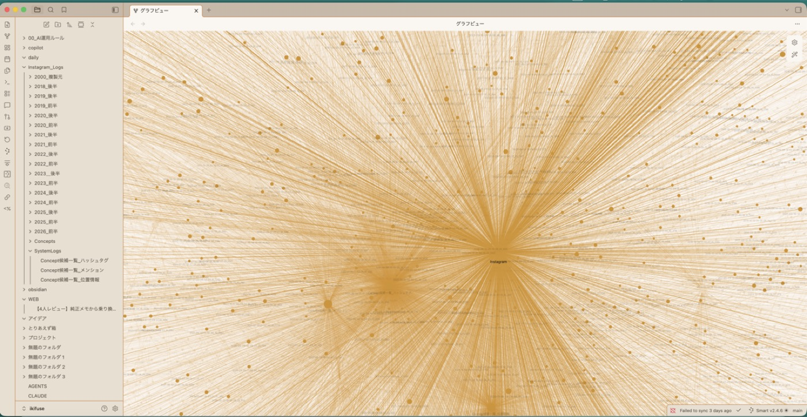
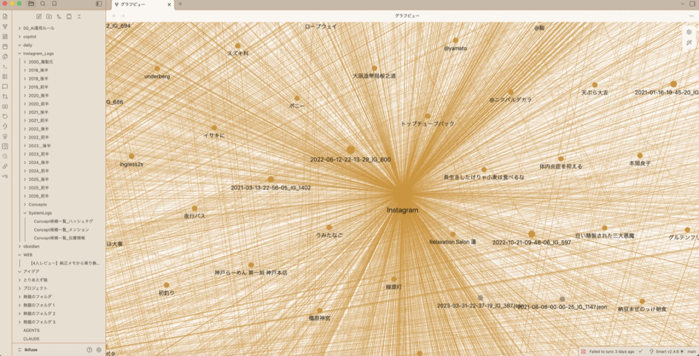
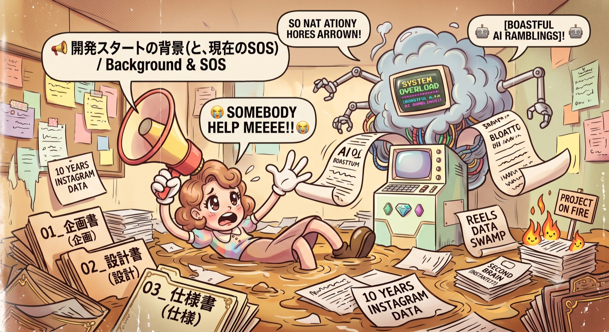
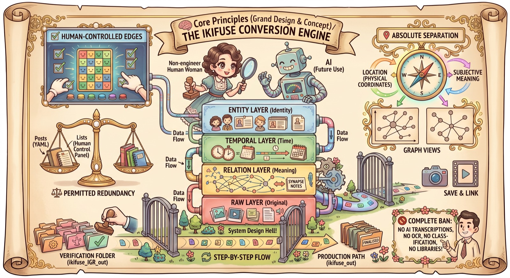
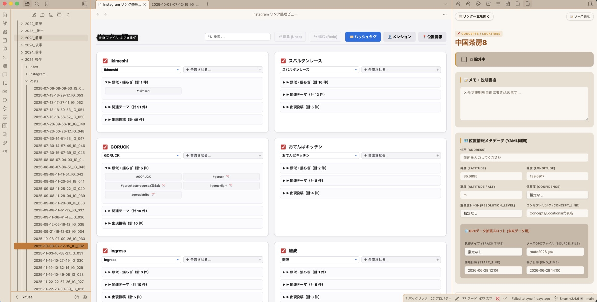

# Metaエクスポートを個人文脈基盤へ再構造化

Instagramからエクスポートした約10年分の記録を、原本を失わず、検索・接続・再利用できるObsidian知識ベースへ変換するプロジェクトです。

これは構想だけのリポジトリではありません。IGP（通常投稿）・IGR（リール）・IGS（ストーリー）は、実データでの正常実行、件数、内容、出力形式を検証し、実用上完成済みと判定しています。IGCには3系統を統合する実行コードと統合済み成果物があり、独立した後続プロジェクトのMemory Synapse DBでは、TypeScript元コード、公開用合成データ90件を収録したブラウザー確認用モック、読み取り専用の仮Obsidianプラグインを使った技術検証へ進んでいます。

> **完成判定・現況反映基準日：2026年7月26日（オーナー承認）**
> 完成条件と変更凍結の正本は、[企画書](01_IG移行企画書v1.0.md)、[設計書目次](02_IG移行設計書/00_設計書目次.md)、[AGENTS.md](AGENTS.md)を参照してください。

このREADMEでいう**親プロジェクト**は、Instagramデータを変換・統合し、最終パッケージとして検証するまでの `obsidian-ig-migration` を指します。親プロジェクトでは、完成済みのIGP・IGR・IGSを守りながら、IGCの統合済み成果物を基に、最終パッケージ化、不要システムファイルの整理、最終完成検証を進めます。これとは完成判定を分け、現在はMemory Synapse DBの技術検証用モックと仮プラグインの実装・確認にも着手しています。

## 一つのアイデア — Memory Synapse

私はコードを1行も読めないし、書けません。AIを勉強し始めてまだ日が浅い非エンジニアで、ただのTAXI運転士です。

このプロジェクトを友人へ見せたとき、「ここまでできていること自体が奇跡だ」と言ってもらえました。一方で、「結局、何を作ろうとしているのか」は十分に伝えられていませんでした。

私自身も、最初から現在の全体像を言葉にできていたわけではありません。

AIを勉強し始めてから、18日間で12個のアプリを作りました。

そのアプリを作っている間、AIへ何度もいろいろなことを説明するのが面倒だと感じるようになりました。

YouTubeでAIについて勉強している中で、Obsidianというノートアプリを知りました。そのとき、「そうだ。Obsidianへメモをためていけば、毎回何度も説明しなくてよくなるのではないか」と考えました。

しかし、自分でメモを一から書いてためていくより、すでに約10年分あるInstagramのデータを、そのまま自分のメモとしてObsidianへ入れてしまえばよいのではないかと思いました。

これが、このプロジェクトの出発点となった一つのアイデアです。約10年分のInstagram記録を、サービスの中に閉じた過去のデータとして残すのではなく、自分で所有できるMarkdownへ移し、人、場所、興味、出来事の関係をObsidian上で確認・修正しながら育てられる記憶へ変えることを目指しました。

この一つのアイデアを技術的に紐解いた結果、InstagramエクスポートJSONを原本から変換・統合する親プロジェクトと、変換された記憶の関係を閲覧・編集するMemory Synapse DBという二つの工程が形になりました。

現在は、データ移行工程とMemory Synapse DBをそれぞれ検証しています。これらを将来、一つのObsidianプラグイン「Memory Synapse」として完結させる案は、プロジェクトを進める中で見えてきた最終形の候補です。ただし、現時点では未採用・未実装の将来構想であり、現在の完成条件には含めていません。

## 🎬 まず、実際に動いている状態を見る

### IGP検証時に、一部成果物をObsidianへ確認投入したグラフビュー

| 拡大図（Instagramをハブとした各ノートの接続） | 全体図（10年分の関係性の広がり） |
| :---: | :---: |
|  |  |

#### 10年分の人生ログがニューロンのようにつながる様子

<video src="https://github.com/user-attachments/assets/81e665e2-34fe-49a9-b1a8-aefb9f37d454" autoplay loop muted playsinline width="100%"></video>

この動画は、元の画面収録から必要な範囲を残し、無音・4倍速にした約1分27秒の実動作記録です。

> この画像と動画はIGP検証時の実動作記録です。現在の開発段階そのものは、後述の「現状と進行ステータス」を参照してください。

## 🗺️ プロジェクト全体マップ

GitHub上では、以下の項目を押すと、リポジトリの構成から各文書の内容へ順番に展開できます。

[▶ ブラウザーでプロジェクト全体マップを開く](https://ikifuse.github.io/obsidian-ig-migration/%E3%83%97%E3%83%AD%E3%82%B8%E3%82%A7%E3%82%AF%E3%83%88%E5%9C%B0%E5%9B%B3/)

## 🧪 現在の検証対象をブラウザーで開く

現在、具体的な意見や修正案を必要としているのは、子プロジェクト `10_Memory_Synapse_DB` のテストサンプルとUIです。コードをダウンロードしなくても、次のリンクからブラウザー確認用モックを直接操作できます。

[▶ Memory Synapse DBのブラウザー確認用モックを開く](https://ikifuse.github.io/obsidian-ig-migration/10_Memory_Synapse_DB/05_Memory_Synapse_DB_%E3%82%B5%E3%83%B3%E3%83%97%E3%83%AB%E6%A4%9C%E8%A8%BC%E3%82%AD%E3%83%83%E3%83%88/%E3%83%96%E3%83%A9%E3%82%A6%E3%82%B6%E3%83%BC%E7%A2%BA%E8%AA%8D%E7%94%A8%E3%83%A2%E3%83%83%E3%82%AF/index.html)

### 📘 初めて確認する方へ

[▶ Memory Synapse DBの操作説明書をPDFで開く（全9ページ）](output/pdf/Memory_Synapse_DB_操作説明書.pdf)

このPDFでは、画面の見方、各ボタン、基本操作、B-01〜B-32の合格条件、読み取り専用06の導入・終了方法、`main.js`が短くなった理由、今回修正した四点および実画面で確認する場所を、色付きの注意枠と表で順番に説明しています。

このモックには、実データや個人情報の代わりに、大阪の公開観光地、架空人物、スポーツ用品、居酒屋メニューを使った公開用合成データ90件を収録しています。融合・分離・取消・表示変更などを実際に試し、「このケースも必要」「この操作では分かりにくい」「この表示へ変えた方がよい」といった提案を、[Issue #3](https://github.com/ikifuse/obsidian-ig-migration/issues/3)へ具体的に提示できる確認環境です。

> 現在の課題は、UIの叩き台が存在しないことではありません。親工程の出力形式との関係を保ちつつ、融合と分離を含む多様な操作を検証できる合成データを整え、実際の操作結果を基にUIを詰めることです。

README内で概要を確認する場合は、以下の項目を押すと、リポジトリの構成から各文書の内容へ順番に展開できます。

<strong>README.md</strong> — このプロジェクトの入口

開発背景と目的

- 毎回AIへ自分の背景を説明する負担を減らす
- 10年分のInstagramデータを「第二の脳」へ変換する
- Obsidian上に検索・接続・再利用できる知識基盤を構築する
- AIとの共同作業で巨大化した企画・設計・仕様を整理し直す
- 現在は機能追加より、既存工程の整合確認と完走を優先する

設計思想（絶対的なルール）

- 観測事実と将来の意味判断を分ける
- 位置情報（物理座標）とシナプス（意味的接続）を分ける
- 4層の不変スキーマを維持する
  - ENTITY：識別
  - TEMPORAL：時間
  - RELATION：関係・意味
  - RAW：原本
- 各データ種別の隔離出力を経由する
- Phase 1ではAI解析・OCR・文字起こし・クラス化を行わない

リポジトリ構成

- 01：プロジェクト全体の企画
- 02：分冊された全体設計
- 03：継続中の判断材料・引継ぎ（Git管理外）
- 04：データ種別ごとの仕様
- 05：IGP通常投稿の移行実行
- 06：IGRリールの移行実行
- 07：IGSストーリーの移行実行
- 08：IGX欠損サルベージ（現在は保留）
- 09：IGC統合
- 10：Memory Synapse DB
- AGENTS.md・docs：プロジェクト共通の作業ルール
- 99：完了済み参考資料（Git管理外）

現在地と、別管理する残作業

1. 完成済みのIGP・IGR・IGSを変更せず維持する
2. 親プロジェクトでは、IGCの統合済み成果物を基に最終パッケージを完成させる
3. 不要システムファイルを整理し、最終成果物を実物で検証する
4. 独立したMemory Synapse DBでは、公開用合成データ90件を使ってブラウザー確認用モックと読み取り専用の仮プラグインを検証する
5. Memory Synapse DB側の要求を、完成済みのIGP・IGR・IGSへ自動的に逆流させない

移行対象と現在のステータス

- IGP：実用上完成済み・原則凍結
- IGR：実用上完成済み・原則凍結
- IGS：実用上完成済み・原則凍結
- IGC：統合済み成果物を基に、最終パッケージ化と最終完成検証を継続
- Memory Synapse DB：独立した後続プロジェクトとして、公開用合成データ90件を使う技術検証用モックと読み取り専用の仮プラグインを実装・確認中
- IGX：親プロジェクトの現在の完走条件から除外

開発参加者向け案内

- 検証には参加者自身のInstagramエクスポートデータが必要
- オーナーは非エンジニアのシステム設計者
- 目的や理由は企画書、構造は設計書、実行条件は仕様書で確認する
- 進行状況と再開点は引継ぎ資料とGitHub Issuesで管理する
- 変更提案は、目的と変更対象を示したIssueとして起票する
- コミュニケーションは日本語を前提とする

<strong>01_IG移行企画書v1.0.md</strong> — 目的・理由・到達点

- [企画書を開く](01_IG移行企画書v1.0.md)
- 第1章：プロジェクト概要
- 第2章：プロジェクトの背景
- 第3章：本プロジェクトが目指すもの
- 第4章：設計判断の基本方針
- 第5章：文書体系と優先順位
- 第6章：将来構想

<strong>02_IG移行設計書</strong> — 全体設計の分冊

00_設計書目次.md

- [設計書目次を開く](02_IG移行設計書/00_設計書目次.md)
- 設計正本の範囲
- 6冊の読み分け
- 企画・仕様・コードとの関係

01_設計目的・対象範囲・基本原則.md

- [文書を開く](02_IG移行設計書/01_設計目的・対象範囲・基本原則.md)
- 設計の目的
- 対象範囲と対象外
- オーナーとAIの責任
- 設計原則
- 文書体系との関係

02_システム全体構成・責任境界.md

- [文書を開く](02_IG移行設計書/02_システム全体構成・責任境界.md)
- システム全体像
- データソース・変換・出力の責任
- IGCの責任境界
- Memory Synapse DBの責任境界
- 人間判断とAI利用の境界

03_データ構造・原本保持設計.md

- [文書を開く](02_IG移行設計書/03_データ構造・原本保持設計.md)
- データの基本単位
- 原本・監査・派生・意味情報の区別
- 識別・日時・関係情報
- メディアと抽出事実
- 将来情報源を追加できる境界

04_データ取得・変換・出力設計.md

- [文書を開く](02_IG移行設計書/04_データ取得・変換・出力設計.md)
- データ種別ごとの独立性
- 入力と原本保持
- 抽出・変換・出力の責任
- 欠損・未知形式・処理失敗
- 再実行・検証・再現性

05_リンク・意味ネットワーク設計.md

- [文書を開く](02_IG移行設計書/05_リンク・意味ネットワーク設計.md)
- Wikiリンク型データベース
- TimelineとSynapse
- 観測事実と意味情報
- 人間が育てる意味ネットワーク

06_検証・運用・保全・拡張設計.md

- [文書を開く](02_IG移行設計書/06_検証・運用・保全・拡張設計.md)
- 検証と完了条件
- 再実行・修復・復旧
- ローカル運用とデータ保護
- 文書・コード・成果物の保全
- 将来拡張の境界

<strong>04_IG移行仕様書</strong> — データ種別ごとの実行条件

01_IG移行共通仕様書v1.2.md

- [文書を開く](04_IG移行仕様書/01_IG移行共通仕様書v1.2.md)
- 共通パイプライン
- YAML・出力ディレクトリ・Markdown
- Synapse・リンク・Timeline
- エラー・ログ・再実行・設定
- 実データ監査による事実差分

02_IGP移行仕様書v1.2.md

- [文書を開く](04_IG移行仕様書/02_IGP移行仕様書v1.2.md)
- 通常投稿の入力
- 投稿・メディア・RawData
- Timeline・Synapse・SystemLogs
- 検証と例外処理

03_IGR移行仕様書v1.2.md

- [文書を開く](04_IG移行仕様書/03_IGR移行仕様書v1.2.md)
- リールの入力
- 動画・投稿情報・RawData
- Timeline・Synapse・SystemLogs
- 検証と例外処理

04_IGS移行仕様書v1.2.md

- [文書を開く](04_IG移行仕様書/04_IGS移行仕様書v1.2.md)
- ストーリーの入力
- Story本文とハイライト所属の分離
- メディア・RawData・Timeline
- Synapse・SystemLogs・検証

05_IGX移行仕様書v1.2.md

- [文書を開く](04_IG移行仕様書/05_IGX移行仕様書v1.2.md)
- 欠損サルベージの対象
- 分類不能データ
- 出力と検証
- 現在は保留

<strong>AGENTS.md ＋ docs</strong> — プロジェクト共通ルール

AGENTS.md

- [共通AGENTSを開く](AGENTS.md)
- 目的と最上位条件
- 全工程で守る判断原則
- 作業範囲と停止条件
- 読み込みルーター
- データ保護
- 編集・記録・外部操作

docs

- [企画工程](docs/planning-workflow.md)
- [設計工程](docs/design-workflow.md)
- [仕様工程](docs/specification-workflow.md)
- [文書の配置・退役](docs/document-governance.md)
- [恒久ルールの追加・修正基準](docs/rule-addition-criteria.md)

<strong>09_IGC統合</strong> — 3系統の出力を統合

01_IGC統合企画書v1.0.md

- [企画書を開く](09_IGC統合/01_IGC統合企画書v1.0.md)
- 実現したいこと
- 出力したいもの
- 3種類の統合
- 人間とUIの役割
- 安全と現在の位置付け

02_IGC統合設計書v1.0.md

- [設計書を開く](09_IGC統合/02_IGC統合設計書v1.0.md)
- 入力と出力
- 統合単位
- Synapse・SystemLogsの統合構造
- 入力不一致とIDの境界
- Memory Synapse DBとの責任境界
- 安全更新と検証条件

03_IGC統合仕様書

- [仕様書目次](09_IGC統合/03_IGC統合仕様書/00_仕様書目次.md)
- [役割・入力形式](09_IGC統合/03_IGC統合仕様書/01_役割・入力形式.md)
- [統合・出力形式](09_IGC統合/03_IGC統合仕様書/02_統合・出力形式.md)
- [異常処理・検証・安全更新](09_IGC統合/03_IGC統合仕様書/03_異常処理・検証・安全更新.md)
- [実行結果・コード構成・対象外](09_IGC統合/03_IGC統合仕様書/04_実行結果・コード構成・対象外.md)

AGENTS.md ＋ docs

- [IGC専用AGENTSを開く](09_IGC統合/AGENTS.md)
- 専用`docs/`は現在未配置
- 共通工程はルートの`docs/`を適用

<strong>10_Memory_Synapse_DB</strong> — Obsidian上で知識を育てる

README.md

- [専用READMEを開く](10_Memory_Synapse_DB/README.md)
- 現在の構成
- 安全上の境界
- ビルド
- レビュー参加者向け案内

01_Memory_Synapse_DB_企画書v2.1.md

- [企画書を開く](10_Memory_Synapse_DB/01_Memory_Synapse_DB_企画書v2.1.md)
- プロジェクトの位置付け
- 解決したい課題
- 実現したい価値
- データを守る原則
- 現在の対象範囲
- 継続して守る原則
- 将来構想
- 文書体系と判断の優先順位

02_Memory_Synapse_DB_設計書

- [設計書目次](10_Memory_Synapse_DB/02_Memory_Synapse_DB_設計書/00_設計書目次.md)
- [目的・入力・データ保護](10_Memory_Synapse_DB/02_Memory_Synapse_DB_設計書/01_目的・入力・データ保護.md)
- [大きなカード・受け皿・融合](10_Memory_Synapse_DB/02_Memory_Synapse_DB_設計書/02_大きなカード・受け皿・融合.md)
- [表示・手書き・分離](10_Memory_Synapse_DB/02_Memory_Synapse_DB_設計書/03_表示・手書き・分離.md)
- [確認環境・実装環境](10_Memory_Synapse_DB/02_Memory_Synapse_DB_設計書/04_確認環境・実装環境.md)

03_Memory_Synapse_DB_仕様書

- [仕様書目次](10_Memory_Synapse_DB/03_Memory_Synapse_DB_仕様書/00_仕様書目次.md)
- [役割・対象データ](10_Memory_Synapse_DB/03_Memory_Synapse_DB_仕様書/01_役割・対象データ.md)
- [個別カード・融合状態](10_Memory_Synapse_DB/03_Memory_Synapse_DB_仕様書/02_個別カード・融合状態.md)
- [表示・手書き情報](10_Memory_Synapse_DB/03_Memory_Synapse_DB_仕様書/03_表示・手書き情報.md)
- [融合・分離・取消・復旧](10_Memory_Synapse_DB/03_Memory_Synapse_DB_仕様書/04_融合・分離・取消・復旧.md)
- [ブラウザー確認・Obsidian実装・実物検証](10_Memory_Synapse_DB/03_Memory_Synapse_DB_仕様書/05_ブラウザー確認・Obsidian実装・実物検証.md)

AGENTS.md ＋ docs

- [Memory Synapse DB専用AGENTS](10_Memory_Synapse_DB/AGENTS.md)
- [専用docs目次](10_Memory_Synapse_DB/docs/README.md)
- [機能相談工程](10_Memory_Synapse_DB/docs/feature-consultation-workflow.md)
- [ブラウザー確認工程](10_Memory_Synapse_DB/docs/browser-confirmation-workflow.md)
- [設計工程](10_Memory_Synapse_DB/docs/design-workflow.md)
- [仕様工程](10_Memory_Synapse_DB/docs/specification-workflow.md)
- [実装工程](10_Memory_Synapse_DB/docs/implementation-workflow.md)

04〜07 実行コード・サンプル検証キット・仮プラグイン・承認検証台帳

- [実行コード目次](10_Memory_Synapse_DB/04_Memory_Synapse_DB_実行コード/00_実行コード目次.md)
- [ビルド・検証方法](10_Memory_Synapse_DB/04_Memory_Synapse_DB_実行コード/99_ビルド・検証方法.md)
- [04_Memory_Synapse_DB_実行コード](10_Memory_Synapse_DB/04_Memory_Synapse_DB_実行コード/)：TypeScript元コード、試験、ビルド設定
- [05_Memory_Synapse_DB_サンプル検証キット](10_Memory_Synapse_DB/05_Memory_Synapse_DB_サンプル検証キット/README.md)：ブラウザー確認用モック、サンプルデータ、サンプルVault、検証ケース台帳、写真・動画と出典
- [ブラウザー確認用モックのHTML](10_Memory_Synapse_DB/05_Memory_Synapse_DB_サンプル検証キット/ブラウザー確認用モック/index.html)：GitHub上で現在のHTMLファイルを確認
- [06_Memory_Synapse_DB_仮プラグイン](10_Memory_Synapse_DB/06_Memory_Synapse_DB_仮プラグイン/memory-synapse-db/)：Vaultを変更しない読み取り専用の技術検証版
- [06のmanifest.json](10_Memory_Synapse_DB/06_Memory_Synapse_DB_仮プラグイン/memory-synapse-db/manifest.json)：プラグイン識別情報
- [07_Memory_Synapse_DB_承認・検証台帳](10_Memory_Synapse_DB/07_Memory_Synapse_DB_承認・検証台帳.md)：変更サイクルの現在地、承認状態、検証結果、Git基準点

公開用合成データは、Mentionに架空人物、Locationに大阪の公開観光地、Tagにスポーツ用品15件と居酒屋メニュー15件を使用しています。Post・Reel・Story各30件の親工程形式ログと双方向に対応させ、実データ、ローカルパス、実在サービスのプロフィールURLを含めない構成です。

> 検証データ構成と現行仕様書の不一致、融合・分離の確認ケースは、[Issue #3](https://github.com/ikifuse/obsidian-ig-migration/issues/3)で管理します。検証結果とオーナー承認を経て仕様へ反映し、ブラウザー上の成立だけをObsidianプラグインの完成とは扱いません。

---

## 1. 📢 開発の背景と、いま整理している理由

> 💡　もともとは、AIの勉強を始めてアプリを作っているときに、「毎回AIに自分の背景を説明するのはめんどくさいな……」と思ったのが始まりです。
>
> 🚀　YouTubeでObsidianというノートアプリを知り、メモをためようとしましたが、自分で一から書く方法ではなかなか情報がたまりませんでした。そこで、**「自分の約10年分のInstagramデータを丸ごと入れれば、一瞬で『第二の脳』ができるのでは？」**という軽い発想から、このプロジェクトを始めました。
>
> 🌋　**……しかし、ここからAIとの泥沼の格闘が始まりました。**
>
> 🤖　AIと相談を続けるうちに、一つのアイデアがどんどん膨らみ、気づけば大量の機能案や仕様書が作られていました。プログラミング経験のないオーナーには、何が「やりたいこと（企画）」で、何が「システム構造（設計）」で、何が「実行条件（仕様）」なのか分からなくなり、AIが話を広げるたびに巨大な概要メモが増える状態になりました。
>
> 📁　「このままでは絶対に破綻する」と気づき、後から一つずつ交通整理して分けたものが、現在の `01` 企画、`02` 設計、`04` 仕様、`05〜10` 実行・統合という文書体系です。これは最初からきれいに設計できたプロジェクトではなく、非エンジニアのオーナーがAIと失敗・検証・修正を繰り返しながら、実際に動くところまで進めてきた記録でもあります。

オーナーは2026年5月27日に、趣味としてAIの勉強を始めました。コードを読むことも書くこともできない状態から、AIへ目的を伝え、実データで結果を確認し、違う部分を言葉で修正しながら進めています。最初は小さなアイデアでしたが、通常投稿、リール、ストーリーの変換、3系統の統合、Obsidian上で知識を育てる仕組みへと広がりました。

現在行っているのは、単なる見栄えの調整ではありません。

- 個人データと公開資料を分離する
- 巨大化した文書を、役割と判断の境界に沿って分ける
- 既存コードと成果物を壊さず、どこから再開するかを明確にする
- 初めて見る人が、実際に動いている範囲と未完成の範囲を判断できるようにする

このREADMEの写真・動画・マップは、その現在地を言葉だけではなく実物で伝えるために置いています。

### 現在確認できている成果

ここでいう**親プロジェクト**とは、このリポジトリ全体を無期限に完成させ続けることではなく、Instagramエクスポートを安全かつ正確に変換し、IGP・IGR・IGSの成果物をIGCで統合して、最終利用可能なパッケージとして検証するまでの `obsidian-ig-migration` の完成範囲を指します。

- IGP（通常投稿）：1,842投稿・7,487メディアを実データで検証し、実用上完成済み
- IGR（リール）：77件を実データで検証し、実用上完成済み
- IGS（ストーリー）：1,521件を実データで検証し、実用上完成済み
- IGC：3系統を統合する実行コードと統合済み成果物が存在する
- Obsidian：IGPの一部を投入し、グラフ表示とカード表示を実物確認できている
- Memory Synapse DB：企画・設計・仕様に加え、TypeScript元コード、公開用合成データ90件を収録したブラウザー確認用モック、読み取り専用の仮プラグインまで作成済み

IGP・IGR・IGSは、正常実行、件数と内容、オーナーが意図した情報と形式を確認したため、上記の基準日に実用上完成済みと判定しました。親プロジェクトには、IGCの統合済み成果物を基にした最終パッケージ化、不要システムファイルの整理、最終完成検証が残っています。Memory Synapse DBは親の完成条件には含めず、独立した技術検証を進めています。

---

## 2. 🧠 本プロジェクトの核心（グランドデザインと設計思想）

🧠　本システムは、単なるデータのバックアップではなく、**「将来的にAIがオーナーの過去の文脈（コンテキスト）を完全に理解するための知識ベース（第二の脳）」**を作るためのデータ変換エンジンです。 

⚙️　そのため、以下の**絶対的なルール・原則（設計思想）**に基づいてコードが書かれています。 

### 2.1. 🌳 親プロジェクトと子プロジェクトの関係

* 🌳　**親プロジェクト `obsidian-ig-migration`** は、MetaのInstagramエクスポートデータを解析し、原本へ戻れる状態を保ちながら、Obsidianで利用できる構造へ安全かつ正確に変換するプロジェクトです。IGP・IGR・IGSの完成済み成果物、IGCによる統合、最終パッケージ化、不要システムファイルの整理、最終完成検証までを完成条件とします。 
* 🔗　**子プロジェクト `09_IGC統合`** は、完成済みのIGP・IGR・IGSを作り直すものではなく、3系統の成果物を最終利用可能な一つのパッケージへ統合します。子プロジェクトですが、その統合結果は親プロジェクトの完成条件に含まれます。 
* 🧠　**子プロジェクト `10_Memory_Synapse_DB`** は、親プロジェクトが生成したSynapseをObsidian上で閲覧・編集・育成する独立した後続プロジェクトです。親の完成条件には含めず、10側の要求を理由に完成済みのIGP・IGR・IGSを自動的に変更しません。 

### 2.2. ⚖️ 観測事実と将来の意味判断を分ける
* ⚖️　現在のIGP・IGR・IGSは、投稿、RawData、メディア、ハッシュタグ・メンション・位置情報の抽出事実を失わず出力します。 
* 🔄　IGCは完成済みの3系統を統合します。人間が行う採用判断、融合・分離、Synapseの閲覧・編集・育成は、独立した後続プロジェクトであるMemory Synapse DBが担当します。 

### 2.3. 📍 位置情報（物理）とシナプス（意味）の絶対分離
* 📍　`location` プロパティは普遍の「物理座標レイヤー（現実座標）」として扱い、主観的な「意味（なぜそこにいたか）」とは明確に切り離してGraph View上で混ざらないようにします。 

### 2.4. 🗂 ユニバーサル不変スキーマ（4層構造）の厳格性
* 🗂　将来の拡張性（FacebookログやGPSログの合流）を見据え、全てのデータは **①ENTITY LAYER（Identity）、②TEMPORAL LAYER（Time）、③RELATION LAYER（Meaning）、④RAW LAYER（Original）** の4層構造に固定して永続化します。 

### 2.5. 🔄 段階的出力フロー（ワンクッション方式）
* 🔄　既存データを破壊しないよう、各データ種別は専用の隔離フォルダ（`output_IGP`、`output_IGR`、`output_IGS`）へ出力します。各抽出工程から`output_IGC`や実Vaultへ直接再実行しません。`output_IGP`の一部をObsidianへ入れたのは、実物を見ながら設計を検証するためであり、本番全件移行ではありません。 

### 2.6. 🚫 AI解析・クラス化の完全禁止（Phase 1 スコープ）
* 🚫　音声の文字起こしやOCR、画像解析、およびコードのクラス化や共通ライブラリ化は**一律禁止**としています。画像・動画は単純な保存とMarkdownへのリンク表示のみに留めます。（※非エンジニアのオーナーがコードの処理を1行ずつ直接理解し、将来も自身で保守し続けるための制約です） 

---

## 3. 📁 リポジトリの構成ファイル

リポジトリ内の詳細なディレクトリ構成、および各機能への案内は **[00_目次.md](00_目次.md)** を参照してください。

---

## 4. 🛠 現在地と、別管理する残作業

🛠　IGP・IGR・IGSは、実データでの正常実行、件数と内容、オーナーが意図した情報と形式を確認したため、実用上完成済みと判定しています。これらは原則凍結し、一般論としての品質改善、リファクタリング、設計の美しさ、将来拡張だけを理由に変更しません。 

親プロジェクトに残る対象は、IGCの統合済み成果物を基にした最終パッケージ化、不要システムファイルの整理、最終完成検証です。Memory Synapse DBは、親の成果物を利用してSynapseを閲覧・編集・育成する独立した後続プロジェクトであり、親の完成条件には含めません。現在は、その技術検証用モックと読み取り専用の仮プラグインを作成・確認する段階へ進んでいます。 

1. 🟢 **通常投稿（IGP）**（完成済み・原則凍結）
   * 1,842投稿・7,487メディアの出力を実成果物で完全検証完了。 
2. 🟢 **リール（IGR）**（完成済み・原則凍結）
   * 77件の出力を同じ完成基準で再検証完了。 
3. 🟢 **ストーリー（IGS）**（完成済み・原則凍結）
   * 1,521件の出力を再検証完了。 
4. 🟡 **IGC・最終パッケージ**（継続）
   * 3系統を統合した既存の`output_IGC`を基に、最終パッケージ化、不要システムファイルの整理、最終完成検証を行います。 
5. 🔵 **Memory Synapse DB**（独立した技術検証）
   * 企画・設計・仕様を作成し、TypeScript元コードから公開用合成データ90件を使うブラウザー確認用モックと読み取り専用の仮プラグインを生成して確認しています。親プロジェクトの完成判定とは分けて管理します。 

🤝　現在の作業状況、未解決事項、引き継ぎは `03_継続中の判断材料・引継ぎ/` や GitHub Issues で管理します。安定した目的・設計・仕様は、リポジトリ内の対応文書を正とします。 

---

## 5. 🟢 現状と進行ステータス

* 🟢　**通常投稿（Post / IGP）移行**：既存出力1,842件のv1.2仕様での再検証完了（エラー0） 
  
  **【グラフビューでの全体像は冒頭のデモを参照】**
  
  **【Obsidian上でのカード化・DM表示イメージ】**
  
  
  **【Obsidian上でのカード表示デモ（実際の操作速度・音声なし）】**

  <video src="https://github.com/user-attachments/assets/1f3e76cc-7c6e-4e36-a446-64753cc8d836" autoplay loop muted playsinline width="100%"></video>

  この動画は、Memory Synapse DBが目指すカード表示と、撮影当時の開発到達点を実画面で伝えるための記録です。個人情報が必要以上に映らない範囲へ切り詰め、音声を削除しています。

* 🟢　**リール（Reel / IGR）移行**：既存出力77件のv1.2仕様での再検証完了（エラー0） 
* 🟢　**ストーリー（Story / IGS）移行**：既存出力1,521件のv1.2仕様での再検証完了（エラー0） 
* 🟡　**IGC統合・最終パッケージ**：統合済み成果物を基に、最終パッケージ化、不要システムファイルの整理、最終完成検証を継続 
* 🔵　**Memory Synapse DB**：企画・設計・仕様を作成済み。公開用合成データ90件を使うブラウザー確認用モックと、読み取り専用の仮プラグインによる技術検証を進行中。検証データと仕様の整合は[Issue #3](https://github.com/ikifuse/obsidian-ig-migration/issues/3)で管理 
* ⚪️　**欠損サルベージ（IGX）移行**：親プロジェクトの現在の完走条件から除外 

---

## 6. 🤝 開発の進め方・ご相談について

* ⚙️　**動作テスト用データの使い分け** 
  * 📦　**親プロジェクトを検証する場合**：検証する方が、ご自身のInstagramデータをMeta社からJSON形式でエクスポートしてダウンロードし、ローカル環境へ配置してください。そのJSONを使ってIGP・IGR・IGSの変換を実行し、必要に応じてIGCによる統合まで検証していただく必要があります。Instagramの実データには個人情報が含まれるため、このリポジトリでは親プロジェクト用の実データを配布できません。使用したJSONと生成成果物は、GitHubへ公開しないでください。 
  * 🧪　**子プロジェクト `10_Memory_Synapse_DB` を検証する場合**：[ブラウザー確認用モック](https://ikifuse.github.io/obsidian-ig-migration/10_Memory_Synapse_DB/05_Memory_Synapse_DB_%E3%82%B5%E3%83%B3%E3%83%97%E3%83%AB%E6%A4%9C%E8%A8%BC%E3%82%AD%E3%83%83%E3%83%88/%E3%83%96%E3%83%A9%E3%82%A6%E3%82%B6%E3%83%BC%E7%A2%BA%E8%AA%8D%E7%94%A8%E3%83%A2%E3%83%83%E3%82%AF/index.html)に、個人情報を含めず公開できる合成データ90件を収録しています。大阪の公開観光地、架空人物、スポーツ用品、居酒屋メニューを使い、融合・分離・取消・表示変更などのUI検証を行えます。この合成データは10の操作とUIを検証するためのものであり、親プロジェクトがMetaのエクスポートJSONを正しく変換できることの検証には使用できません。 
* 👤　**オーナーは非エンジニア（コードを1行も読む事も書くことも出来ないAIを勉強し始めて間もないただのタクシー運転手です）です** 
  * 💬　難しいプログラミングやコードの書き方に関する質問には直接お答えできない場合があります。技術的な判断はエンジニアの皆様にお任せする部分が多くなります。なお、オーナーは日本語のみを理解するため、README・Issue・やり取りも日本語を前提にしています。 
* 🗺️　**まずは企画書と設計書をご確認ください** 
  * 🔍　目的や判断理由で迷った場合は『企画書（01_）』へ、構造やデータ設計で迷った場合は『設計書（02_）』へ戻って確認してください。 
* 🧭　**現在の進行状況や再開ポイントについて** 
  * 📌　現在の進行状況や作業再開ポイントは、最新の引き継ぎ資料や GitHub Issues を参照してください。引き継ぎ資料の名称や対象は進行状況に応じて変わるため、README では固定リンク化していません。 
* 💡　**提案ベースでのIssue起票は大歓迎です！** 
  * 🚀　バグ修正や「こう変更した方が良い」というアイデアがあれば、エンジニア同士で自由にIssueを立てて議論・整理を進めていただくか、「〇〇という目的のために、コードをこう変えたい」という具体的な提案の形でIssueを作っていただけると大変助かります。 

