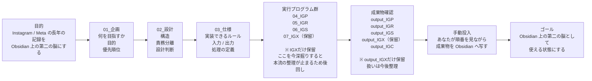

# 01_目的からゴールへの流れ v1.0

この図は、`obsidian-ig-migration` の本流だけを一本で見るためのものです。
詳細に枝分かれせず、「何を目指し、どの順番で進み、どこで手動判断が入るか」を掴むことを優先します。

## 読み方

- `01` から `03` までは、文書を整える段階です。
- `04_IGP` / `05_IGR` / `06_IGS` は本流の個別実行です。
- `07_IGX` は存在するが、今は本流整理を止めないために保留しています。
- `output_IGC` は本番側の統合成果物です。
- 最後は人間が投入順序を見ながら Obsidian へ反映します。
