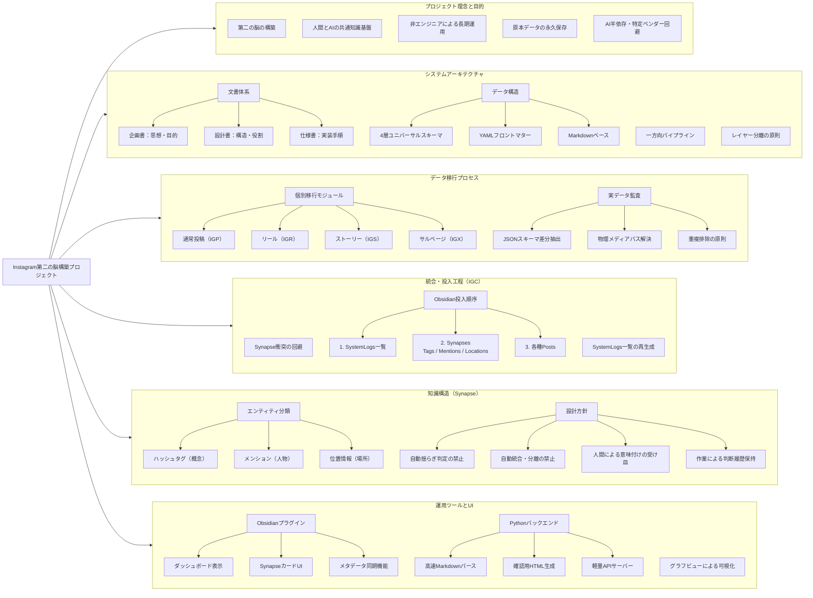

# 02_全体像 v1.0

この図は、プロジェクト全体を「役割の塊」で俯瞰するためのものです。
NotebookLM の理解用マップを参考にしつつ、GitHub 上で読めるように Markdown + Mermaid で再構成しています。

## 読み方

- `プロジェクト理念と目的` は、なぜこのプロジェクトをやるのかです。
- `システムアーキテクチャ` は、文書・データ・レイヤーの設計思想です。
- `データ移行プロセス` は、IGP / IGR / IGS / IGX と監査処理の全体です。
- `統合・投入工程（IGC）` は、今まさに詰めている統合と投入順序の領域です。
- `知識構造（Synapse）` は、何をどういう意味でノート化するかのルールです。
- `運用ツールとUI` は、最終的に人が使う側の機能群です。
