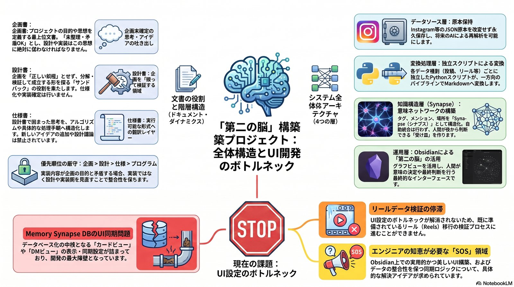
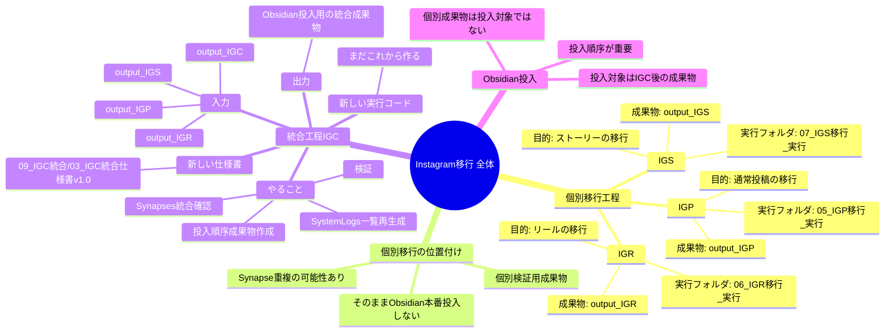
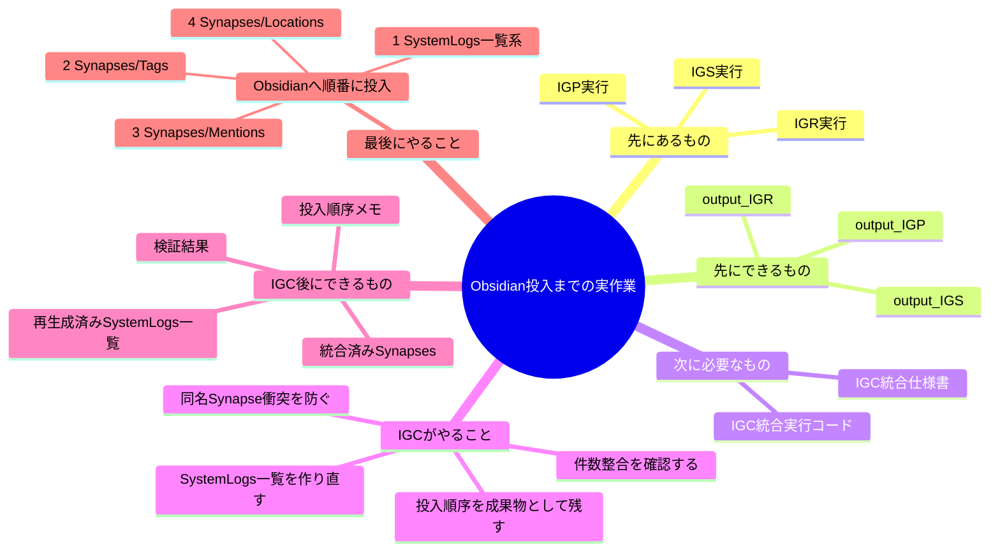

# IGC統合理解マインドマップ

このメモは、IGP / IGR / IGS の個別移行と、IGC による統合工程と、Obsidian投入前に人間が何を理解していればよいかを切り分けて整理するための理解用メモである。

「プログラムの構造」と「実際の作業順」は混同しやすいため、図を分けて扱う。

---

## 1. プログラム全体の構造

---

## 2. あなたが実際に見る作業順

---

## 3. いまの現在地

いま終わっているもの:

* 引き継ぎ書の整理
* 設計書への設計付箋追記
* IGC 新仕様書の新規作成

いままだ終わっていないもの:

* IGC 仕様書の詳細化
* IGC 実行コードの作成
* IGC による統合成果物の生成
* Obsidian への本番投入

---

## 4. いま次にやるべきこと

いま次にやることは、Obsidian投入そのものではない。

いまはまだ IGC の仕様を詰める段階であり、特に以下を先に確定すると迷いにくい。

* IGC の入力をどこまで必須にするか
* Synapse 統合確認の具体ルール
* SystemLogs 一覧の出力形式
* 検証失敗時の扱い

この4点が固まると、そのまま IGC 実行コードの設計へ進める。
